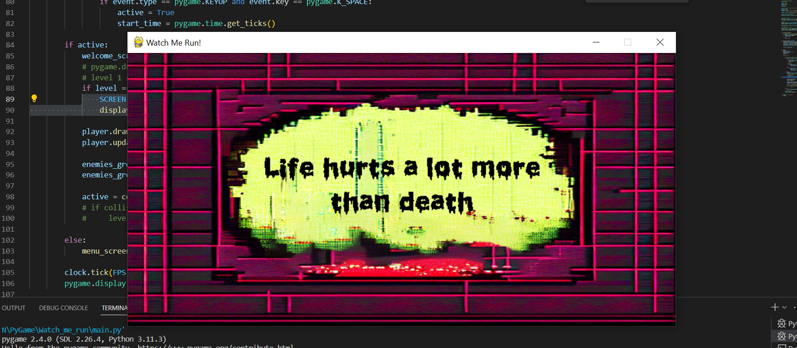

<h1 align="center">Watch Me Run</h1>
<h2 align="center">My first attempt at creating a 2D pixel-art game</h2>

# WORK IN PROGRESS

I'm improving this project bit by bit in my spare time, and it's still in the early stage of development. I want to create proper 'Welcome' screen, add a few more levels of difficulty, various kinds of enemies (and make each of them behave in slightly different way) and compose simple game music on my own.

# About

 I decided to take on this challenge to push myself out of my comfort zone and to master my skills in a language I'm passionate about. I am treating it primarily as a coding challenge, but I'll also try my best to make it , let's say, not unpleasant to look at.

<h1 align="center">I will be adding more details about the project later on!</h1>

